# NXP Application Code Hub

## SJA1124EVB : Quad LIN Commander Transceiver with LIN Commander Controller
The SJA1124 is a quad local interconnect network (LIN) commander channel device. Each of the four channels contains a LIN commander controller and LIN transceiver with commander termination. LIN commander frames are transferred to the physical LIN bus via the LIN physical layer

This demo application provides a command line interface which allows the user to easily explore the different functions of the driver to configure different device configurations of SJA1124.

### SJA1124EVB Block Diagram

[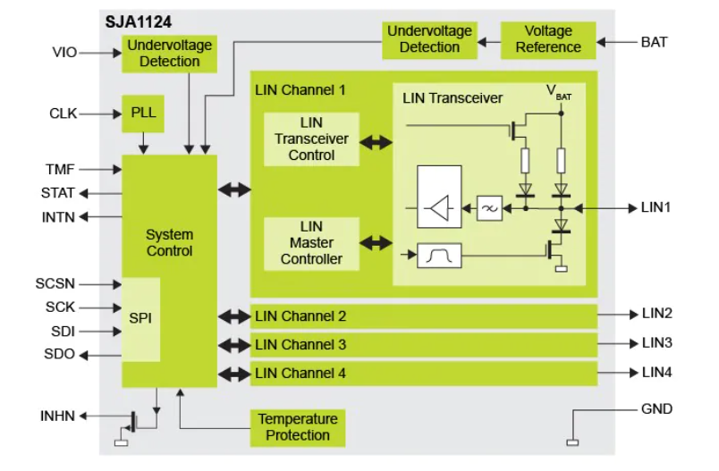](SJA1124_Block_Diagram.PNG)

### Key Features of SJA1124: SPI to Quad-LIN Bridge Driver
- Four LIN commander channels:
  - LIN commander controller
  - LIN transceiver
  - LIN commander termination consisting of a diode and a pull-up resistor.
  
- Very low current consumption in Low-Power mode with wake-up via SPI or LIN
- SPI for communicating with the microcontroller:

  - SPI used for configuration, control, diagnosis and LIN data transfer
  - Flexible SPI length from 3 bytes to 18 bytes
  - Output status pin signals SPI operational state

- LIN Commander Controllers:
  
  - Independent per LIN channel: Baud rate, Operating mode and interrupt
  - Complete LIN frame handling and transfer
  - Programmable break length
  - Programmable stop bit length
  - Hardware or software checksum generation
  - The fractional baud rate generator

#### Boards: FRDM-MCXN947, FRDM-MCXA153
#### Categories: Bridge
#### Peripherals: SPI
#### Toolchains: MCUXpresso IDE

## Table of Contents
1. [Software](#step1)
2. [Hardware](#step2)
3. [Setup](#step3)
4. [Test Application Steps](#step4)
5. [Known Limitations](#step5)
6. [FAQs](#step6) 
7. [Support](#step7)
8. [Release Notes](#step8)

## 1. Software
- [IoT Sensing SDK (ISSDK) v1.8](https://nxp.com/iot-sensing-sdk) offered as middleware in MCUXpresso SDK for supported platforms
- [MCUXpresso IDE v11.9.0](https://www.nxp.com/design/design-center/software/development-software/mcuxpresso-software-and-tools-/mcuxpresso-integrated-development-environment-ide:MCUXpresso-IDE)

## 2. Hardware
- FRDM-MCXN947 and FRDM-MCXA153 MCU board
- [SJA1124EVB](https://www.nxp.com/part/SJA1124EVB) 
- Personal Computer
- Mini/micro C USB cable

## 3. Setup
### 3.1 Step 1: Download and Install required Software(s)
- Install MCUXpresso IDE 11.9.0
- Download and Install [MCUXpresso SDK v2.14.0 for FRDM-MCXN947](https://mcuxpresso.nxp.com/en/builder?hw=FRDM-MCXN947). Make sure to select ISSDK  middleware while building SDK.
- Download and Install [MCUXpresso SDK v2.14.2 for FRDM-MCXA153](https://mcuxpresso.nxp.com/en/builder?hw=FRDM-MCXA153). Make sure to select ISSDK  middleware while building SDK.
- Install Git v2.39.0 (for cloning and running west commands).
- Install Putty/Teraterm for UART.

### 3.2 Step 2: Clone the APP-CODE-HUB/dm-sja1124evb-spi-to-quad-lin-bridge
- Clone this repository to get the example projects:
- Change directory to cloned project folder: 
    cd *dm-sja1124evb-spi-to-quad-lin-bridge*
 
**Note:** If you are using Windows to clone the project, then please configure filename length limit using below command

**git config --system core.longpaths true**

### 3.3 Step 3: Build example projects
- Open MCUXpresso IDE and select a directory to create your workspace.
- Install MCXUpresso SDK 2.14.x for FRDM-MCX947, FRDM-MCXA153 (drag and drop SDK zip into "Installed SDK" view) into MCUXpresso IDE.
- Go to "Quickstart Panel" and click on "Import Project(s) from file system",
- Select "Project directory (unpacked)" and browse to the cloned project folder.
- Select example projects that you want to open and run.
- Right click on project and select build to start building the project.

## 4. Test Application Steps
- User needs to make the connection between shield board (SJA1124EVB) and Base boards (MCXA153 & MCXN947) using jumper wires.

  [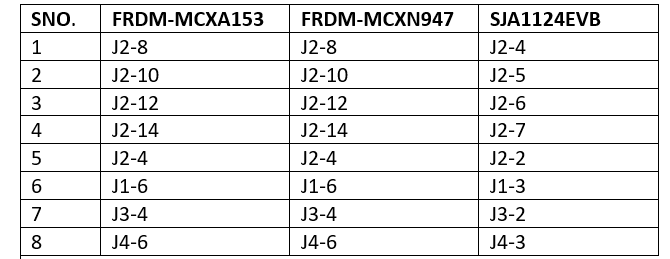](Jumper_settings.PNG)

  [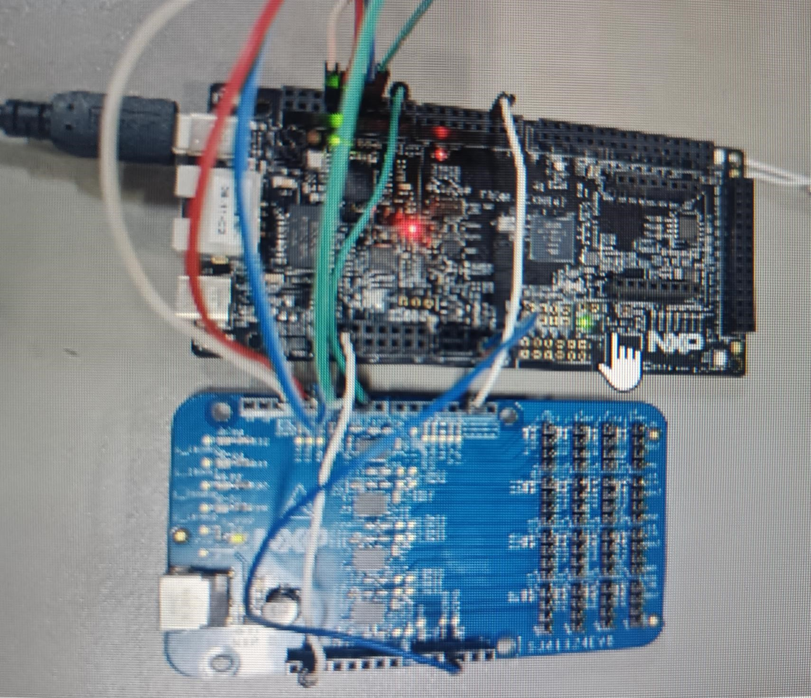](Hardware_Setup.jpg)

- User need to check COM port after connecting USB cable between Host PC and Target Board via device manager.

  [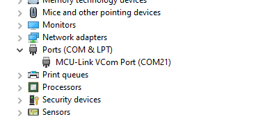](device_manager.png)

- Open PUTTY/Teraterm application installed on your Windows PC with Baudrate 115200 and assigned COM port as mentioned in above step.

  [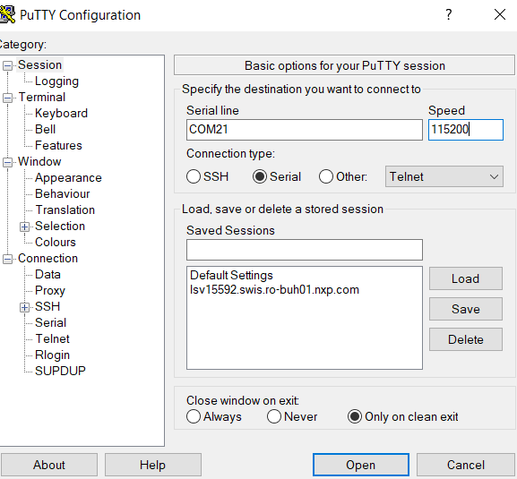](Putty_Serial_Terminal.png)

- After right click on project and select "Debug As", Demo application will run in interactive mode. When the demo runs successfully, you can see the logs printed on the terminal.

## 4.1 Logs Results

**Main Menu will look like this**

[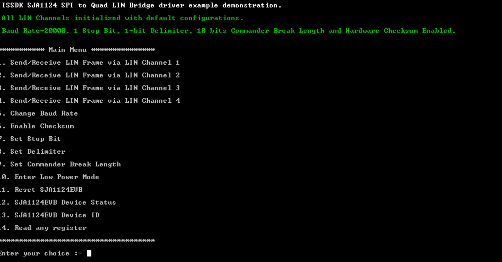](Main_menu.png)

**Choose options #1 to #4 to Send/Receive LIN Frame via respective LIN Channel** 

  - Press #1 to Send/Receive LIN Frame via LIN Channel 1

     - Send/Receive LIN Frame provides two options:

           - Send LIN Frame
           - Receive LIN Frame 

     - Refer below logs:
    
       - To Send LIN Frame : Enter number of bytes to send and data bytes from Commander to Responder.

          
       
       - To Receive LIN Frame: Enter number of bytes to receive from Responder to Commander.

         [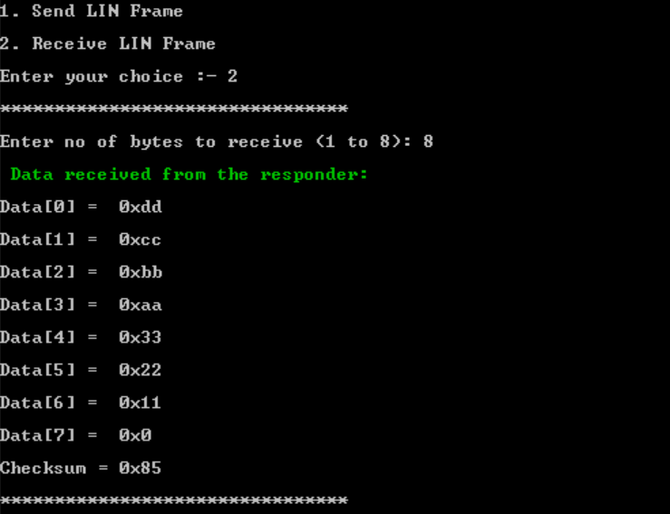](Log_receive_frame.png)
       

  Note: 
  
  - Same size of LIN frames should be send/receive via both commander and responder.

**Choose option #5 to change baud rate for respective LIN Channel** 

  - Press #1 to #4 to select specific LIN Channel 
     
    

  - Enter Baud rate in Hz 
     
      [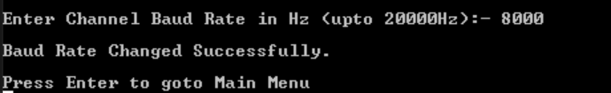](Log_baud_rate.png)

  Note: SJA1124 supports baud rates up to 20 kBd.

**Choose option #6 to enable hardware/software checksum for respective LIN Channel** 

- Press #1 to #4 to select specific LIN Channel 
     
    
    
- Enable checksum provides two options 

       - Hardware Checksum
       - Software Checksum

- Refer below logs to enable checksum.

     

**Choose option #7 to set stop bit for respective LIN Channel** 

Stop bit determines the number of stop bits in the transmitted data. The STOP bit is
configured for all fields (Delimiter, Sync, ID, Checksum and payload).

- Press #1 to #4 to select specific LIN Channel 
     
  
    
- Refer below logs to set stop bit.

   

**Choose option #8 to set delimiter for respective LIN Channel** 

Delimiter is used to make LIN frame synchronization in-between commander and responder.

- Press #1 to #4 to select specific LIN Channel 
     
    

 - Refer below logs to set delimiter.

    

**Choose option #9 to set commander break length for respective LIN Channel** 

Commander break length field acts as a “start of frame" notice to all LIN nodes on the bus.

- Press #1 to #4 to select specific LIN Channel 
     
   
    
- Refer below logs to set commander break length.

  [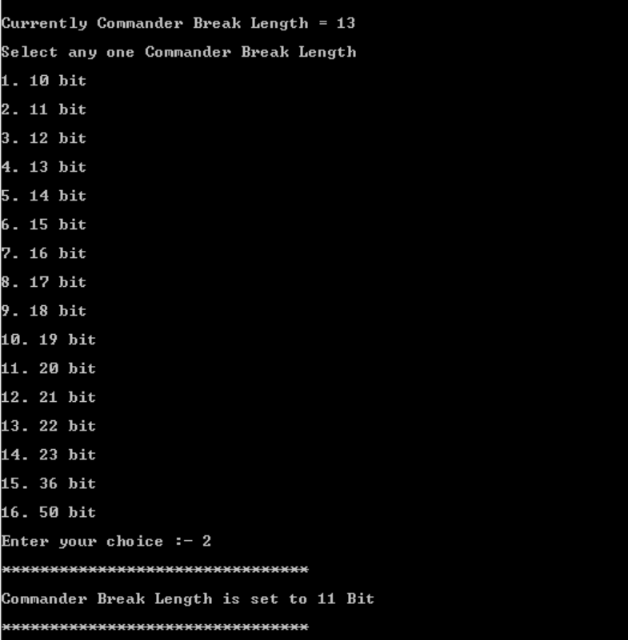](Log_commander_length.png)

**Choose option #10 for device to enter into low power mode** 

The SJA1124 supports two main operating modes:
1) Normal mode 
2) Low Power mode.

     The SJA1124 consumes significantly less power in Low Power mode than in Normal mode. While current consumption is very low in Low Power mode, the SJA1124 can still detect SPI and remote wake-up events on pins LINx.
  
- After entering into low power mode, SJA1124 provides two options:

      - Wake-up via SPI
      - Wake-up via LIN Channel

- Enter #1 to exit from low power mode via SPI wake-up event.

     [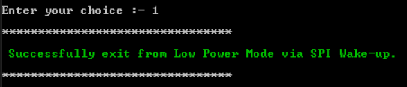](Log_exit_low_power_spi.png)

- Enter #2 to exit from low power mode via LIN wake-up event. 
   
    [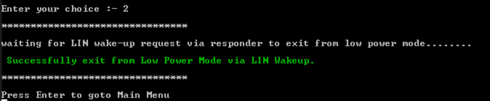](Log_exit_low_power_lin.png)

    Note: In case of LIN wake-up event, device will wait for LIN wake-up frame via responder to exit from low power mode.
     

**Choose option #11 to reset SJA1124EVB**

- On resetting the SJA1124 device all LIN channels initialized with default configurations.

- Baud Rate-20000, 1 Stop Bit, 1-bit Delimiter, 10 bits Commander Break Length and Hardware Checksum Enabled.

  [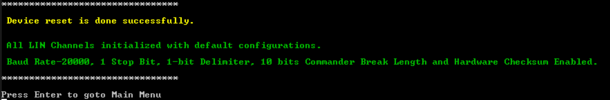](Log_reset.png)

**Choose option #12 to read SJA1124EVB Device status**

- SJA1124EVB device provides 3 options:

       - PLL lock status
       - Over-temperature warning
       - PLL input frequency status

- Enter #1 to read PLL lock status.

 [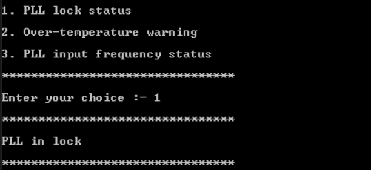](Log_device_status.png)

 - Similarly Enter #2 and #3 to read over-temperature warning and PLL input freqeuncy status respectively.

**Choose option #13 to read SJA1124EVB Device ID**

 [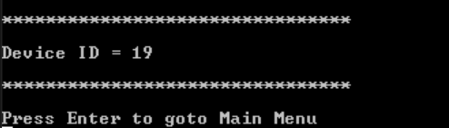](Log_device_ID.png)

**Choose option #14 to read any SJA1124EVB device register**

- Enter register address in hex to read the value stored.

 

## 5. Known Limitations
 1) The SJA1124 uses a Phase-Locked Loop (PLL) to generate a high-frequency clock signal from an external reference clock (in this scenario provided by the base board itself) on the CLK input pin.

- All the input frequency are working for SJA1124 except two.
  - 0.5 MHz to 0.69 MHz
  - 6.0 MHz to 7.99 MHz
    
2) Do not stack the SJA1124EVB on base boards via arduino header. SJA1124EVB requires external battery supply voltage(VBAT) to operate in normal mode and due to stacking high voltage pin which is connected with the base board can corrupt the base board.

## 6. FAQs
*No FAQs have been identified for this project.*

## 7. Support

#### Project Metadata
<!----- Boards ----->
 

<!----- Categories ----->

<!----- Peripherals ----->

<!----- Toolchains ----->

Questions regarding the content/correctness of this example can be entered as issues within this GitHub repository.

>**Note**: For more general technical questions regarding NXP Microcontrollers and the difference in expected funcionality, enter your questions on the [NXP Community Forum](https://community.nxp.com/)

## 8. Release Notes
| Version | Description / Update                           | Date                        |
|:-------:|------------------------------------------------|----------------------------:|
| 1.0     | Initial release on Application Code Hub        | Aug 30th 2024 |

